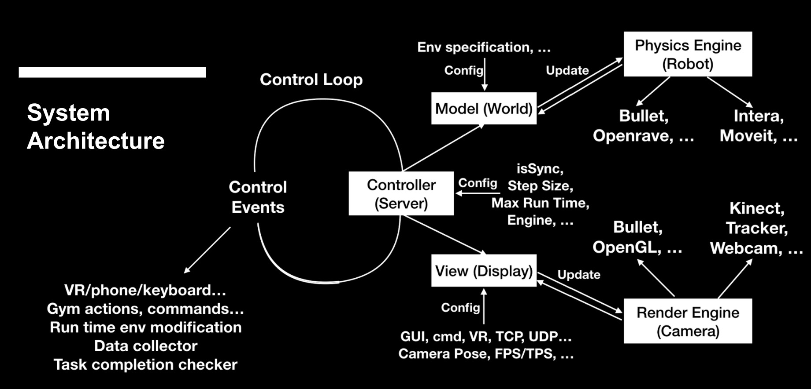

# perls

## Design Diagram

Read more about API docs in this [Wiki](https://github.com/JulianYG/perls/wiki).

## Directory Tree (Non-comprehensive)
* [Installation script](./setup.py)
* [Test scripts, collecting demons, trajectory record post-processing](./scripts)
* [Links for Sawyer arm urdf, gripper urdf, etc.](./urdf)
* [Robot calibration, collision mesh generation, **fresh Linux/cluster/robot setup instructions**](./tools)
* perls
  - [Body definitions](./perls/entity)
  - [Simulation configurations](./perls/configs)
  - [Gym environments](./perls/gym_)
  - [Task specifications, aligned between gym and demo collection](./perls/handler/taskHandler.py)
  - Robot Functionalities
    * [Moveit! configurations](./perls/robot/sawyer_moveit_config)
    * [grasping](./perls/robot/grasp)
    * [Calibration data, **calibration instructions**](./perls/robot/calibration)
    * Utilities
      * [Point Cloud pose registration](./perls/robot/utils/pcl_segment.py)

## Bullet Windows Instructions

Change the python path in `build_visual_studio_vr_pybullet_double.bat`, and double click the file. Target solutions will be generated. Open the solution and retarget all projects. Right click and build all projects.

- URDF & SDF files: `$bullet\data`

- Docs: `$bullet\docs`

- Generated solution: `$bullet\build3\vs2010`

- Executables (Including built pybullet DLL): `$bullet\bin`

- Pybullet DLL (Windows): `~$Python\DLLs\pybullet.pyd`
